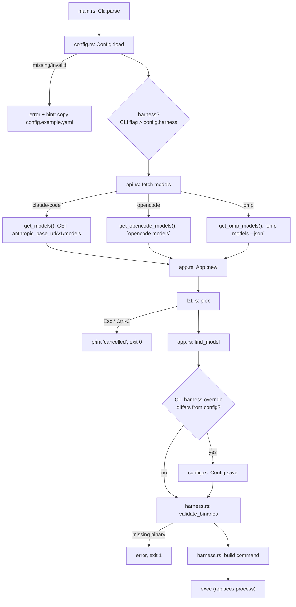

# ai-pick — App Flow

Entry point: `src/main.rs` → `async fn main()` (`src/main.rs:12`), run under `#[tokio::main]`.

`main` is a straight-line pipeline: parse args → load config → fetch models → pick model → persist override → validate binaries → `exec` the harness. The last step replaces the process, so `main` never returns on success.

## Flow

## Where each file enters the workflow

| File | Role | Key items |
|------|------|-----------|
| `src/main.rs` | Entrypoint and orchestrator. Wires every other module together. | `main()` at `src/main.rs:12`; harness dispatch at `src/main.rs:26` and `src/main.rs:57`; persistence guard at `src/main.rs:44` |
| `src/cli.rs` | Argument parsing via `clap`. | `Cli` struct; `harness_override()` (`src/cli.rs:32`) maps `--claude-code` / `--opencode` / `--omp` to a `Harness`; flags `--no-jail`, `--no-memory`, `--config` |
| `src/config.rs` | YAML config load/save + harness enum. | `Config::load` (`src/config.rs:70`), `Config::save` (`src/config.rs:82`), `Harness` enum (`config.rs:9`), `normalize()` turns empty override strings into `None` |
| `src/api.rs` | Model discovery — one function per harness. | `get_models()` (async HTTP, bearer auth), `get_opencode_models()` (parses stdout lines), `get_omp_models()` (parses `--json`) |
| `src/app.rs` | Domain types + selection glue. | `Model { id, name, context_length }`, `display()` (name → id fallback), `App::select_model()` (`src/app.rs:43`) maps displays through fzf and back to the full `Model` |
| `src/fzf.rs` | External `fzf` picker. | `pick()` (`src/fzf.rs:6`) pipes options into `fzf`, returns `Ok(None)` on cancel (non-zero exit / empty output) |
| `src/harness.rs` | Command assembly + pre-exec checks. | `validate_binaries()` (`src/harness.rs:17`), `wrap_with_jail()` (`src/harness.rs:39`), `claude_envs()` (`src/harness.rs:60`), `build_claude_command()` / `build_harness_command()` |
| `src/tests/harness.rs` | Tests only. Referenced from `harness.rs` via `#[path]`, so it is a submodule with access to private items |

## Step-by-step

1. **Parse args** — `Cli::parse()` (`cli.rs`). Harness flags are mutually exclusive (`conflicts_with_all`).
2. **Load config** — path from `--config` or `Config::config_path()` (`~/.config/ai-pick/config.yaml`). Load failure appends a hint to copy `config.example.yaml`. `normalize()` runs after deserialization.
3. **Resolve harness** — `cli_args.harness_override().unwrap_or(config.harness)`. Done *before* model fetch because each harness has its own discovery mechanism.
4. **Fetch models** — three shapes, all ending in `Vec<Model>`:
   - `claude-code`: async `GET {anthropic_base_url}/v1/models` with bearer auth, decoded as `ModelResponse { data: Vec<Model> }`.
   - `opencode`: runs `opencode models`, one model ID per line, no names/context lengths.
   - `omp`: runs `omp models --json`, decoded via `OmpModel` → `Model` conversion.
5. **Pick model** — `App::select_model()` shows `display()` strings in fzf, then maps the selected line back with `find_model()`. Cancel (`Esc`/`Ctrl-C`) → prints `cancelled` and exits 0 without touching config.
6. **Persist harness override** — only if a CLI flag was given *and* differs from `config.harness`. Runs after selection on purpose: cancellations and pre-picker errors never rewrite `config.yaml`. `Config::save` rewrites the YAML and drops comments.
7. **Validate binaries** — `harness::validate_binaries(no_jail, no_memory)`:
   - `--no-jail` → nothing to check (harness runs bare).
   - else → `ai-jail` required; `ai-memory` also required unless `--no-memory`.
   - Missing binary → stderr + `exit 1`.
8. **Build and exec** — depends on harness:
   - `claude-code`: `build_claude_command()` adds envs (`ANTHROPIC_AUTH_TOKEN=ollama`, `ANTHROPIC_API_KEY`, `ANTHROPIC_BASE_URL`, optional `CLAUDE_CODE_MAX_CONTEXT_TOKENS` from `model.context_length`, optional `ANTHROPIC_DEFAULT_*` / `CLAUDE_CODE_SUBAGENT_MODEL` overrides) and args `--model <id>`.
   - `opencode` / `omp`: `build_harness_command(name, ...)` → `<name> --model <id>`, no envs.
   - Unless `--no-jail`, the command is wrapped: `ai-jail --gpu --network --agent-state --no-status-bar [--env K=V]... [ai-memory run] <harness> --model <id>`. With `--no-memory` the `ai-memory run` segment is dropped.

## Invariants

- `exec` (`std::os::unix::process::CommandExt`) replaces the ai-pick process; anything after it only runs if exec failed.
- Config is read once up front; the only write is step 6.
- fzf cancellation is `Ok(None)`, not an error — same path as an empty model list (`fzf::pick` returns `None` immediately when there is nothing to show).
- Model discovery errors (network, binary missing, bad JSON) propagate up from step 4 and abort before the picker opens.
